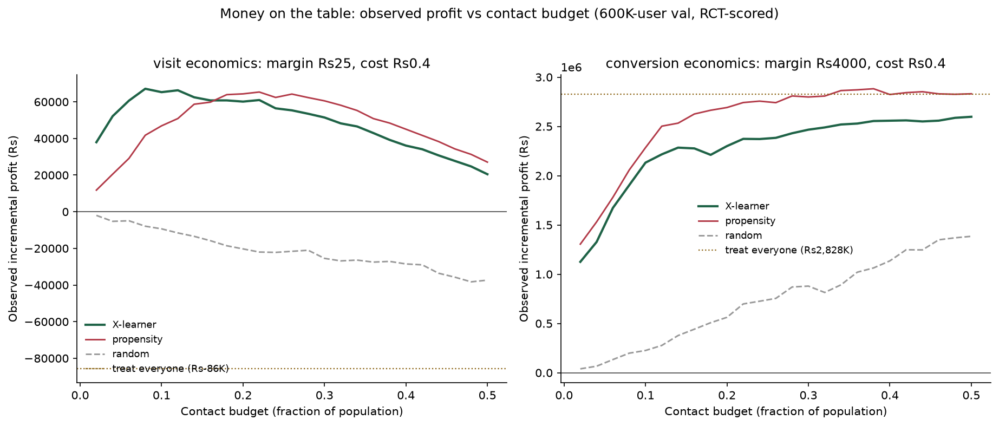

# Incremental — a causal targeting engine

**Who should we actually contact — not who will convert.**

[](https://github.com/gtushar05/incremental/actions)
**Live demo:** [gtushar-05-incremental-cockpit.static.hf.space](https://gtushar-05-incremental-cockpit.static.hf.space) · **Write-up:** [WRITEUP.md](WRITEUP.md) · **Pre-registration:** [PREREGISTRATION.md](PREREGISTRATION.md)

Response models rank users by P(convert) and burn campaign budget on people
who would have converted anyway. This project learns **individual treatment
effects** (uplift) from 13.9M-user randomized-experiment data — meta-learners
implemented from scratch — and turns them into a **budget-constrained
targeting policy with quantified incremental profit**, evaluated once on
sealed, pre-registered holdout data.



*Under stated economics (₹25/incremental visit, ₹0.40/contact), treating
everyone **loses** money. Targeting is not an optimization here — it is the
difference between a loss and a profit.*

## Headline numbers — frozen, one-shot, sealed holdout

All numbers below come from a **single pre-registered evaluation** of golden
holdouts sealed (hashed into git) before any model existed: 4,193,879 Criteo
rows + 19,200 Hillstrom rows. See [PREREGISTRATION.md](PREREGISTRATION.md);
verify the seals in the git log.

| Claim | Result (95% CI) |
|---|---|
| Lift concentrated in X-learner's top decile (visit) | **6.33pp** [5.98, 6.65] — ~6× the 1.03pp population ATE |
| vs propensity targeting at top decile (paired delta) | **+1.17pp** [+0.89, +1.48] — separable |
| Uplift score calibration (predicted vs RCT-observed, by decile) | **r = 0.996** |
| Frozen 8%-budget policy profit (4.19M users) | **₹480,498** vs propensity ₹327,287 (+47%) vs treat-all **−₹577,472** |
| Conversion label (0.29% base rate) — the honest one | propensity **beats** X on Qini: −0.000032 [−0.000059, −0.000002], separable |
| Confirmatory rollout A/B design | 7.2pp effect on 21.3% base in target group → only **984 users/arm** (α=.05, power .80) |

## The four findings

1. **The industry default measurably burns money.** Response-model targeting
   forfeits 14–17% of capturable lift at 30–50% budgets — its ranking is
   non-monotonic in true effect (oracle-efficiency analysis, Day 2).
2. **Small data is fog.** On 64K rows (Hillstrom), uplift vs propensity is
   statistically undecidable. Stated with CIs, not hidden.
3. **At scale, uplift wins exactly where theory predicts** — the top of the
   ranking, on a responsive outcome. CI-separable on 4.19M sealed rows; at
   thin margins the 8% policy flips the campaign from loss to profit.
4. **And loses exactly where theory predicts** — at a 0.29% base rate,
   effect-differencing is noise-dominated and the simpler propensity model
   wins; with fat margins (₹4,000/conversion), treat-all is near-optimal
   anyway. **The deliverable is a decision boundary between methods, not a
   victory lap:** uplift pays on responsive outcomes under tight budgets;
   response models remain right for ultra-rare outcomes; when margin dwarfs
   cost, don't target at all.

## How it works

```
RCT data ─▶ validation ─▶ uplift learners ─▶ evaluation ─▶ policy ─▶ confirmation
  Criteo     SRM χ² ·      T-learner          hand-rolled     budget      one-shot sealed
  13.9M      SMD balance   X-learner          Qini/AUUC ·     knapsack ·  holdout eval ·
  Hillstrom  golden        (from scratch,     bootstrap +     marginal-   confirmatory
  64K        holdouts      vs sklift          paired-delta    profit      A/B design
             sealed        r = 1.000000)      CIs · calibr.   rule        (984/arm)
```

- **Uplift learners** ([src/incremental/uplift.py](src/incremental/uplift.py)):
  T- and X-learner (Künzel et al.) with injectable XGBoost bases — the
  T-learner is **bit-identical to sklift's TwoModels** (r = 1.000000, max
  diff 0); the X-learner is verified on synthetic RCTs with known τ(x).
- **Evaluation** ([metrics.py](src/incremental/metrics.py),
  [evaluation.py](src/incremental/evaluation.py)): hand-rolled Qini curves,
  uplift@k, stratified 200-resample bootstrap CIs, **paired delta CIs** for
  model comparisons, calibration-by-decile, quadrant analysis.
- **Policy** ([policy.py](src/incremental/policy.py)): the model *chooses*
  who to contact; the money is *scored* by treated-vs-control differences
  inside the chosen group — the experiment judges, never the model.
- **Scale**: DuckDB ETL over 13.9M rows on a laptop; models train in 8–17s
  (`tree_method=hist`); hyperparameters chosen by out-of-fold Qini (uplift
  needs shallow, heavily-regularized trees — depth 2 won).

## Method integrity (the part to audit)

- **Sealed holdouts:** Hillstrom holdout SHA256 `4b1e135a…` and Criteo
  aggregate fingerprint `eabff873…` committed **before any model run** —
  dated commits in this repo's history. Each was evaluated exactly once.
- **Pre-registered decision rules:** the primary-label gate, sampling
  protocol (train on a documented 2M stratified sample, evaluate on the full
  holdout), and bootstrap protocol were committed before results existed.
  The gate then bound this README to headline a metric where our own models
  **lose** (conversions). That's the point.
- **Paired-delta inference:** comparisons use the same bootstrap resamples on
  both rankings; overlapping individual CIs cannot adjudicate differences.
- **The bug the machinery caught:** a mathematically impossible CI (point
  outside its own interval) exposed an arm-clustered tie-ordering bias in the
  profit layer — a 167,100-row tied score block meeting strata-ordered rows.
  Fixed with rank-space tie-breaking; regression-tested; the first additive
  jitter fix itself failed on constant scores (float absorption) and was
  caught by its own test. Full story in the Day-8 commits.

## Reproduce

```bash
python3 -m venv .venv && source .venv/bin/activate
pip install -e ".[model,dev]" duckdb streamlit
pytest                                  # 29 tests: synthetic ground truth + regressions
python scripts/day1_validate.py         # randomization checks, seal the holdout
python scripts/day2_baseline.py         # propensity baseline + misallocation exhibit
python scripts/day3_uplift.py           # T/X-learners + sklift parity
python scripts/day4_tune.py             # OOF-Qini hyperparameter selection
python scripts/day5_evaluate.py         # CIs, calibration, quadrants (Hillstrom)
python scripts/day6_criteo_etl.py       # 13.9M ETL + Criteo seal (downloads ~300MB)
python scripts/day6_criteo_models.py    # Criteo models + val scores
python scripts/day7_gate.py             # the pre-registered label gate
python scripts/day8_policy.py           # profit curves + money chart
python scripts/day9_holdout.py          # THE one-shot holdout evaluation (~75 min)
```

Data notes: Hillstrom downloads automatically (MineThatData). Criteo-UPLIFT
v2 now lives on Hugging Face (`criteo/criteo-uplift`) — the original
criteo.net and sklift S3 links are dead. Python 3.14; `causalml` doesn't
build on 3.14, hence sklift + synthetic ground truth for verification.

## Repo map

```
src/incremental/   validation · data · features · baseline · uplift · metrics · evaluation · policy · brief
scripts/           one runnable script per build day + deploy_space.sh
tests/             29 tests — synthetic-RCT ground truth, library parity, regression tests
reports/           every number in this README, as JSON + charts
app/ + index.html  decision cockpit (Streamlit for local; static HTML on HF Spaces)
PREREGISTRATION.md sealed-holdout hashes + pre-committed decision rules
```

## Honest limitations

Built solo in a 14-day sprint (~45h). Deliberately cut, in scope order for a
full build: FastAPI/Docker serving with latency benchmarks, S/DR-learners
from scratch (library versions appear in comparisons), formal off-policy
estimators (IPS/SNIPS/DR — policy value is reported directly against RCT
truth instead), and the X5 RetailHero RFM module. (The LLM brief-writer,
originally cut, shipped on Day 13 in micro form: validator-gated generation
with an adversarial test suite — see src/incremental/brief.py.) Economics are stated illustrative scenarios; the profit *shapes* are
scenario-robust, the rupee levels are not. With observational (non-RCT)
data, every causal claim here would weaken to assumption-laden estimates —
that boundary is discussed in [WRITEUP.md](WRITEUP.md).

## Build log

14-day sprint, days 1–12 complete. The full day-by-day log with metrics
lives in the commit history — each day is one commit with its findings.
